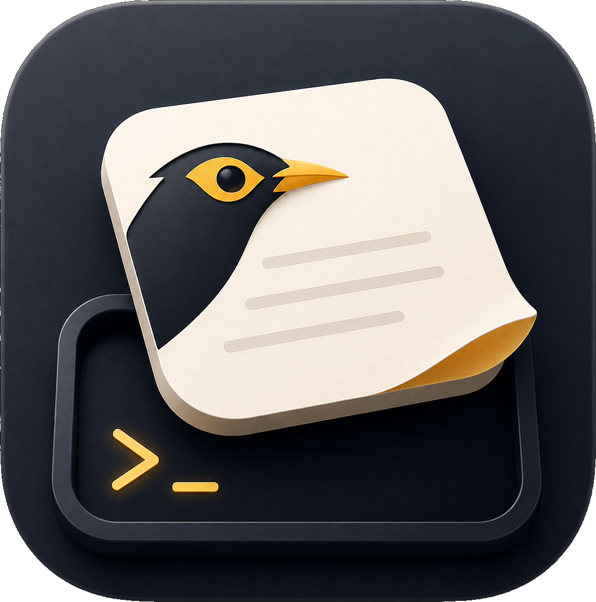

<p align="center">
  
</p>

<h1 align="center">MynahPad</h1>

<p align="center">
  A lightweight macOS menu-bar app for storing text prompts and pasting them
  into your terminal with a double-click.
</p>

## Install

1. Download the latest **`MynahPad-X.Y.Z.dmg`** from the
   [Releases page](https://github.com/90n9/mynah-pad/releases/latest).
2. Open the DMG and drag **MynahPad.app** into **Applications**.
3. The first launch is blocked by macOS Gatekeeper (*"MynahPad cannot be
   opened"* or *"is damaged"*). Run this once in Terminal to bypass it:

   ```bash
   xattr -dr com.apple.quarantine /Applications/MynahPad.app
   ```

4. Double-click **MynahPad** in `/Applications`. Grant **Accessibility** when
   prompted (System Settings → Privacy & Security → Accessibility). Without
   it, MynahPad can't paste into your terminal.

A `📝` icon appears in the menu bar — you're ready.

## Usage

1. Click the `📝` icon → **Show Window**.
2. Type a prompt in **New idea…** and press Return to save it.
3. Switch to your terminal, then **double-click** the note to paste it.
4. Used notes turn grey with a ✓. Right-click for Reset / Delete / Move.

Notes are stored at `~/.config/mynahpad/notes.json`.

## Updates

MynahPad updates itself silently in the background. The next time you quit
the app, the new version installs automatically — no dialogs, no clicks.

---

- **Build from source / contribute**: [CONTRIBUTING.md](CONTRIBUTING.md)
- **Changelog**: [CHANGELOG.md](CHANGELOG.md)
- **License**: MIT
